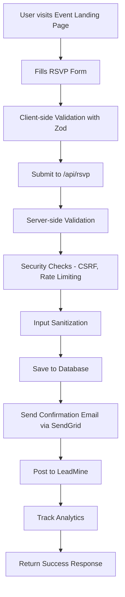
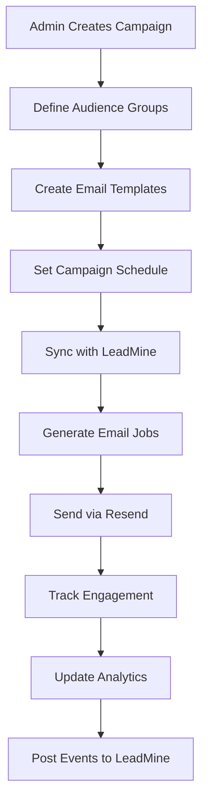
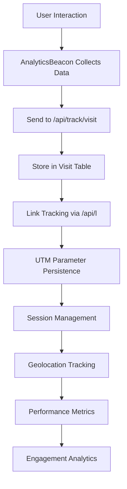
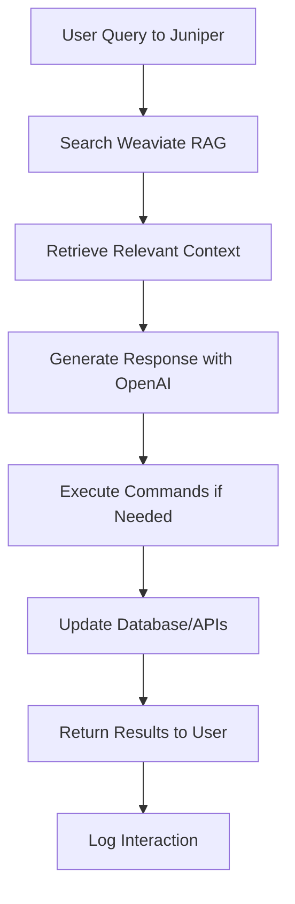

# RSVP Application Process Documentation
## Comprehensive System Interconnections and Workflows

This document provides a complete overview of how all components in the RSVP application interconnect and work together to create a comprehensive email campaign and event management system.

## System Architecture Overview

```
┌─────────────────────────────────────────────────────────────────┐
│                    RSVP Application Ecosystem                   │
├─────────────────────────────────────────────────────────────────┤
│  Frontend (Next.js + React + TypeScript)                       │
│  ├── Event Landing Page                                         │
│  ├── RSVP Form (Multi-step with validation)                    │
│  ├── Admin Dashboard                                            │
│  └── Analytics Dashboard                                        │
├─────────────────────────────────────────────────────────────────┤
│  Backend (Next.js API Routes + Prisma + PostgreSQL)            │
│  ├── RSVP Processing                                            │
│  ├── Campaign Management                                        │
│  ├── Email Sending (Resend + SendGrid)                         │
│  ├── Analytics Collection                                       │
│  └── Admin Authentication                                       │
├─────────────────────────────────────────────────────────────────┤
│  External Services Integration                                  │
│  ├── LeadMine (Business Data)                                  │
│  ├── Weaviate (Vector Database + RAG)                          │
│  ├── ImprovMX (Email Receiving)                                │
│  └── OpenAI (AI Agent)                                         │
└─────────────────────────────────────────────────────────────────┘
```

## Core Process Flows

### 1. RSVP Submission Process



**Key Components:**
- **Frontend**: `src/components/RsvpForm.tsx` - Multi-step form with real-time validation
- **Validation**: `src/lib/validators.ts` - Zod schemas with XSS protection
- **API**: `src/app/api/rsvp/route.ts` - Secure endpoint with comprehensive validation
- **Email**: `src/lib/sendgrid-email.ts` - Transactional email sending
- **Analytics**: `src/components/AnalyticsBeacon.tsx` - Client-side tracking

### 2. Campaign Management Process



**Key Components:**
- **Campaign Creation**: `src/app/api/admin/campaign/campaigns/route.ts`
- **Template Management**: `src/app/api/admin/campaign/templates/route.ts`
- **Audience Management**: `src/app/api/admin/campaign/groups/route.ts`
- **Email Sending**: `src/lib/email-sender.ts` - Campaign email delivery
- **LeadMine Integration**: `src/lib/leadMine.ts` - Business data sync

### 3. Analytics and Tracking Process



**Key Components:**
- **Client Tracking**: `src/components/AnalyticsBeacon.tsx` - Comprehensive data collection
- **Visit API**: `src/app/api/track/visit/route.ts` - Server-side analytics storage
- **Link Tracking**: `src/app/api/l/route.ts` - Campaign attribution
- **Middleware**: `middleware.ts` - UTM persistence and session management

### 4. AI Agent Integration Process



**Key Components:**
- **RAG System**: `training-data/weaviate-rag-system.py` - Vector search and context
- **AI Agent**: Custom SLM fine-tuned with Qwen2.5-3B
- **Vector Database**: Weaviate with comprehensive training data
- **Context Sources**: Training data, codebase, brand context, processes

## Component Interconnections

### Database Schema Relationships

```sql
-- Core entities and their relationships
AudienceGroup (1) ──→ (N) AudienceMember
AudienceGroup (1) ──→ (N) CampaignSchedule
Campaign (1) ──→ (N) CampaignTemplate
Campaign (1) ──→ (N) CampaignSchedule
CampaignSchedule (1) ──→ (N) CampaignSend
CampaignSend (1) ──→ (N) EmailJob
EmailJob (1) ──→ (N) EmailEvent
RSVP (1) ──→ (N) Visit (via analytics)
```

### API Endpoint Dependencies

```
Admin Authentication Flow:
/admin/login → requireAdminSession() → JWT verification → Admin routes

Campaign Management Flow:
/api/admin/campaign/campaigns → requireAdminSession() → Prisma operations
/api/admin/campaign/templates → requireAdminSession() → Template CRUD
/api/admin/campaign/groups → requireAdminSession() → Audience management
/api/admin/campaign/send → requireAdminSession() → Email sending

Public API Flow:
/api/rsvp → CSRF protection → Rate limiting → Validation → Database
/api/track/visit → Analytics collection → Visit storage
/api/l → Link tracking → Visit recording → Redirect
```

### Email System Integration

```
Campaign Emails (Resend):
Campaign → Template Rendering → Resend API → Delivery Tracking → Webhooks

Transactional Emails (SendGrid):
RSVP Submission → SendGrid API → Confirmation Email → Webhook Events

Email Receiving (ImprovMX):
Incoming Emails → ImprovMX → Webhook → Processing → Database Updates
```

## Security Architecture

### Multi-Layer Security Implementation

1. **Input Layer Security**
   - XSS prevention via input sanitization
   - CSRF protection with origin/referer validation
   - Rate limiting with IP fingerprinting
   - Zod schema validation

2. **Authentication Security**
   - JWT tokens with expiration
   - HTTP-only cookies
   - Session management
   - Admin route protection

3. **Data Security**
   - IP address hashing
   - Secure headers (CSP, HSTS, etc.)
   - Input length limits
   - SQL injection prevention via Prisma

4. **Monitoring Security**
   - Security event logging
   - Violation tracking
   - Alert system
   - Audit trails

## Performance Optimization

### Caching Strategy
- Static generation for event pages
- API response caching
- Database query optimization
- Image optimization

### Monitoring and Analytics
- Real-time performance metrics
- User interaction tracking
- Error monitoring
- Uptime monitoring

## Error Handling and Recovery

### Comprehensive Error Management
1. **Client-side Errors**
   - Form validation errors
   - Network error handling
   - User feedback systems

2. **Server-side Errors**
   - API error responses
   - Database error handling
   - External service failures

3. **Recovery Mechanisms**
   - Retry logic for external APIs
   - Fallback systems
   - Graceful degradation

## Development and Deployment

### Development Workflow
1. **Local Development**
   - Next.js dev server
   - Prisma database
   - Environment configuration

2. **Testing Strategy**
   - Unit tests with Jest
   - Integration tests
   - E2E testing

3. **Deployment Pipeline**
   - Vercel deployment
   - Environment variables
   - Database migrations

## AI Agent Integration

### RAG System Architecture
```
User Query → Vector Search → Context Retrieval → AI Generation → Response
     ↓              ↓              ↓              ↓           ↓
  Weaviate → Training Data → Codebase → Brand Context → OpenAI/SLM
```

### Training Data Categories
1. **Campaign Management** (20 examples)
2. **Email Template Management** (10 examples)
3. **Security Features** (1 example)
4. **Admin Authentication** (1 example)
5. **Audience Management** (1 example)
6. **LeadMine Integration** (1 example)
7. **Webhook Handling** (1 example)
8. **Privacy & Compliance** (1 example)
9. **Event Management** (1 example)
10. **Form Validation** (1 example)
11. **Middleware Features** (1 example)
12. **Analytics & Tracking** (1 example)
13. **Global Template System** (3 examples)
14. **Email Sending System** (2 examples)
15. **Complete Email System** (2 examples)
16. **RSVP Data Management** (2 examples)

### Vector Database Structure
- **Training Data Collection**: Vectorized training examples with code snippets
- **Codebase Collection**: Extracted knowledge from source code
- **Brand Context Collection**: Evergreen-specific business context
- **Processes Collection**: Workflow and process documentation
- **APIs Collection**: API endpoint documentation and usage

## Evergreen Brand Integration

### Brand Context Elements
- **Company**: Evergreen Web Solutions
- **Owner**: Gabriel Lacroix
- **Location**: Terrace, BC, Canada
- **Business Focus**: AI automation for Northern BC businesses
- **Event**: AI in Northern BC Information Session
- **Venue**: Sunshine Inn Terrace — Jasmine Room
- **Date**: October 23, 2025

### Technical Stack Alignment
- **Frontend**: Next.js, React, TypeScript, Tailwind CSS
- **Backend**: Prisma, PostgreSQL, Next.js API routes
- **Email**: Resend (campaigns), SendGrid (transactional)
- **AI**: Weaviate (RAG), OpenAI (generation), Qwen2.5-3B (SLM)
- **Security**: CSRF, rate limiting, JWT, input sanitization

## Maintenance and Updates

### Regular Maintenance Tasks
1. **Database Maintenance**
   - Data retention cleanup
   - Index optimization
   - Backup verification

2. **Security Updates**
   - Dependency updates
   - Security patch application
   - Vulnerability scanning

3. **Performance Monitoring**
   - Response time tracking
   - Error rate monitoring
   - Resource usage optimization

### Update Procedures
1. **Code Updates**
   - Feature branch development
   - Testing and validation
   - Deployment to staging
   - Production deployment

2. **Data Updates**
   - Training data updates
   - Vector database reindexing
   - Brand context updates

This comprehensive process documentation provides the foundation for understanding how all components of the RSVP application work together to create a robust, secure, and intelligent email campaign and event management system.

